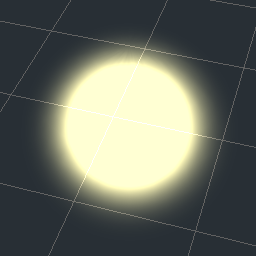
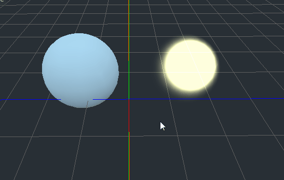

# PulseGlow shader for Godot Engine

Pulsating light shader for Godot 3.0+ (using GLES3). 
Apply only to meshes with rounded corners!

Author:	Fernando Cosentino

	
### Usage: ###

This shader is based on the dot product between the face normal and the camera view vector, so it works best on smooth round surfaces with many triangles, ideally spheres.

In the example below the two spheres are geometrically identical. The one in the left has a SpatialMaterial with a diffuse white color (blue tone given by default sky). The one in the right has a ShaderMaterial with the PulseGlow shader.

### Parameters: ###

The shader has the following parameters:

* **Albedo**: base object color. Albedo's alpha channel works, but avoid using it for transparency. It is implemented to support alhpa in textures. For global transparency, use the Opacity parameter instead.
			
* **Albedo Texture**: texture for albedo. Alpha channel works.
	
* **Saturation**: higher values increase the flat color area in the center, with fast alpha slope on edges. Lower values cause blurred, softer gradients in the edges.
	
* **Pulse Rate**: how many times the light pulses per second.
	
* **Pulse Intensity**: how big the light becomes during pulses, relative to original object size. Pulses are created by moving the vertices along the triangles' normals during rendering. If applied to collideable objects, the collision shapes are unnafected.
	
* **Opacity**: alpha. Use this in animations to make objects fade in or out.

May work with GLES2 but not tested.

### License ###

MIT - See the LICENSE file in this repository.

